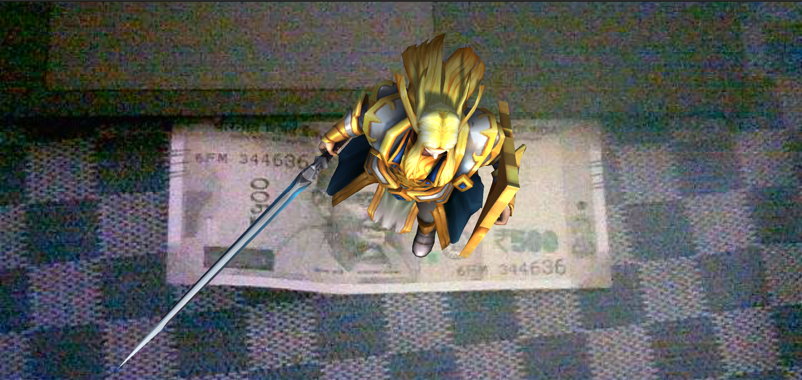

# MarkerBasedAR using Vuforia

## Description
This repository contains a project focused on marker-based augmented reality using Vuforia. In this project, the application identifies a targeted image from a database. When the application is launched and the targeted image is placed in front of the camera, a 3D animated object is augmented onto the image, providing an immersive augmented reality experience.

## Features
- Marker-based augmented reality: Utilizes markers to trigger the placement of 3D animated objects onto targeted images.
- Database integration: Supports the identification of targeted images from a database for seamless AR interaction.
- Real-time rendering: Renders the augmented 3D objects in real-time, ensuring a smooth and immersive experience.
- Customizable objects: Allows for the customization of the augmented objects to suit various applications and scenarios.

## How to Play
1. Clone the repository to your local machine.
2. Ensure you have the necessary dependencies installed.
3. Launch the application on your device.
4. Place the targeted image in front of the camera.
5. Enjoy the augmented reality experience as the 3D animated object appears on top of the targeted image.

## Controls
- No specific controls are required as the application operates based on marker detection and camera interaction.

## Screenshots

Feel free to contribute to the project by providing feedback, suggesting improvements, or adding new features. Happy augmenting! 🚀

## Contributing

Feel free to contribute to the project by opening issues or creating pull requests. Follow the guidelines outlined in [CONTRIBUTING.md].

## License

This project is licensed under the [MIT License] - see the [LICENSE.md] file for details.
